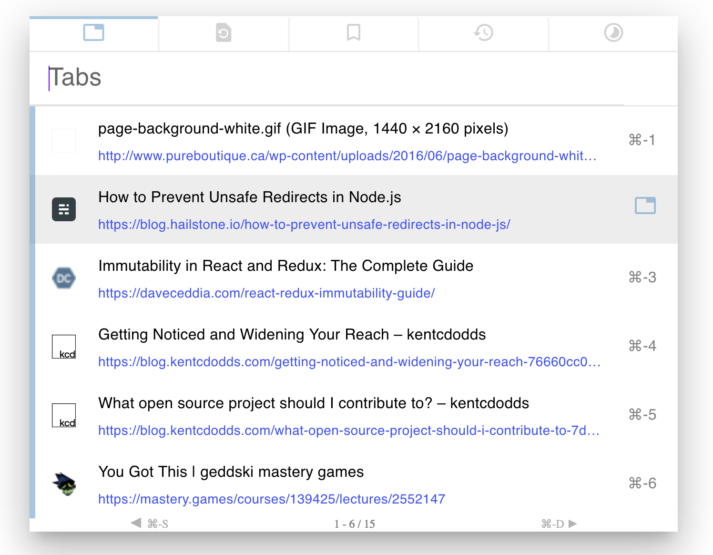

# Saka

A browsing assistant for [Firefox](https://addons.mozilla.org/firefox/addon/saka/) and [Chrome](https://chrome.google.com/webstore/detail/saka/nbdfpcokndmapcollfpjdpjlabnibjdi) designed to be fast, intuitive, and beautiful. Inspired by Spotlight. Keyboard-focused but mouse friendly too.

* Lists tabs in order of recency by default, then fuzzy search by title or URL.
* Search recently closed tabs
* Search all bookmarks
* Search all browsing history



## Install

Install Saka from the [Firefox Marketplace](https://addons.mozilla.org/firefox/addon/saka/) or [Chrome Webstore](https://chrome.google.com/webstore/detail/saka/nbdfpcokndmapcollfpjdpjlabnibjdi).

### Install on Chrome

1.  Run the following commands in your terminal to clone and build Saka.
    An extension you can run will be generated in the 'dist' directory.


    ```sh
    git clone https://github.com/lusakasa/saka.git
    cd saka
    npm install
    npm run build:chrome
    # or if you want to generate an optimized production build
    npm run build:prod:chrome
    ```

2.  Navigate to `chrome://extensions`

3.  Enable developer mode and click 'Load Unpacked Extension'

4.  Select the dist directory, and 🚀.

5.  Refresh existing tabs to load Saka into them

### Install on Firefox

1.  Run the following commands in your terminal to clone and build Saka.
    An extension you can run will be generated in the 'dist' directory.

    ```sh
    git clone https://github.com/lusakasa/saka.git
    cd saka
    npm install
    npm run build:firefox
    # or if you want to generate an optimized production build
    npm run build:prod:firefox
    ```

2.  Navigate to `about:debugging`

3.  Enable add-on debugging and click 'Load Temporary Add-on'

4.  Select any file within the dist directory, and 🚀.

5.  Firefox will load Saka automatically into all valid existing tabs

## Release Instructions (for maintainers)

1. Update the version number in `/static/manifest.json`

2. Make a commit and set the message to the version: `git commit -m "v0.15.2"`

3. Tag the commit with the version and a message describing changes since the last release: `git tag -a v0.15.2`

4. Push the commit to github with tags: `git push origin --follow-tags`

5. View the build status at https://travis-ci.org/lusakasa/saka/ and generated releases at https://github.com/lusakasa/saka/releases

## License

MIT Licensed, Copyright (c) 2017 Sufyan Dawoodjee, Uzair Shamim
